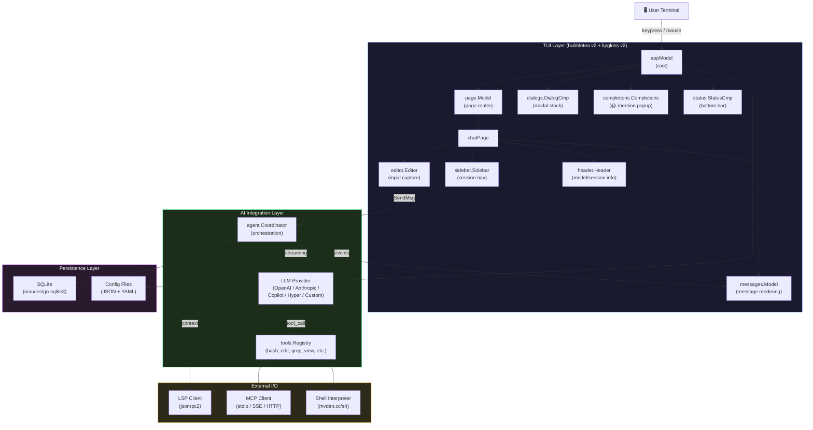
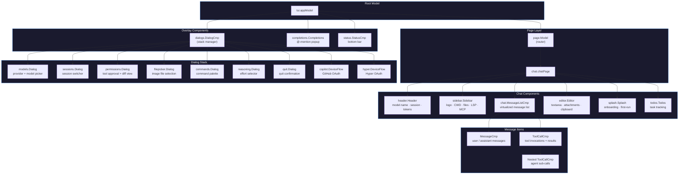
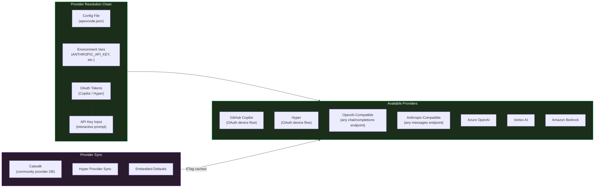
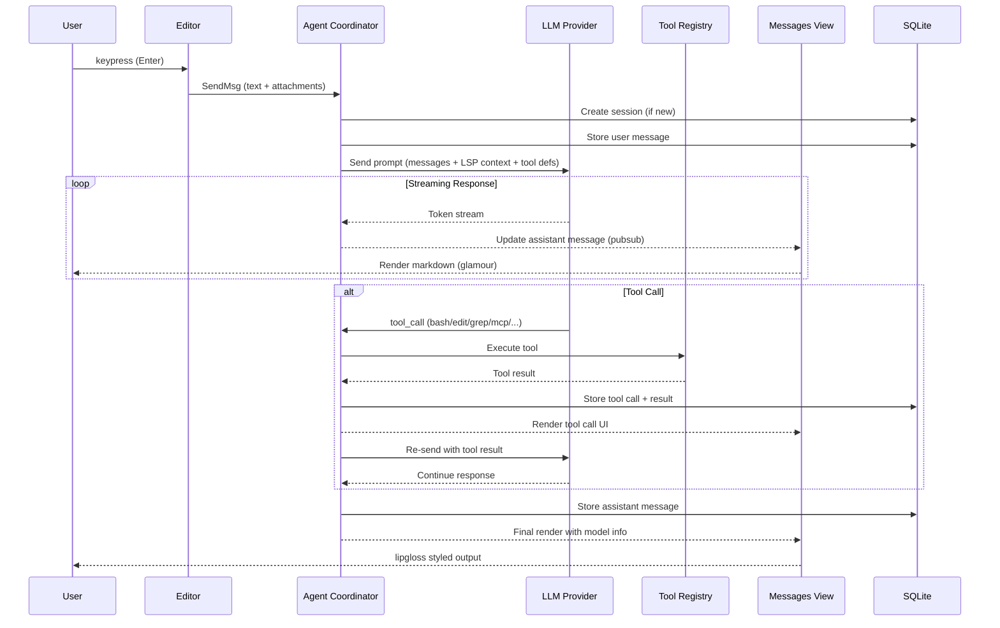
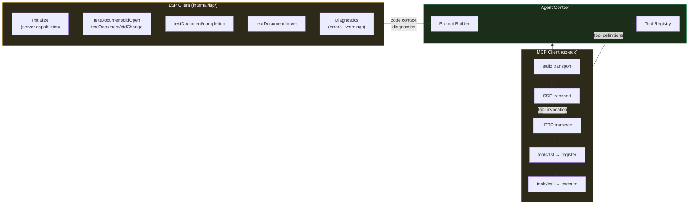
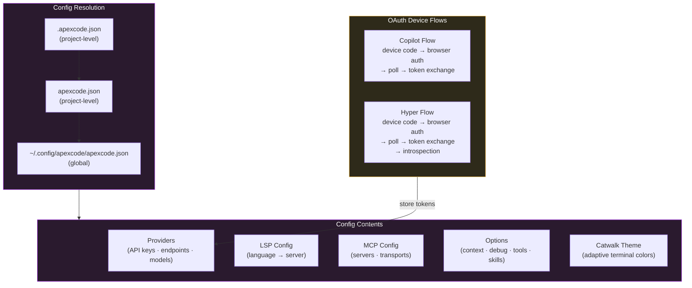

# ApexCode

<p align="center">
    <a href="https://stuff.charm.sh/apexcode/charm-apexcode.png"></a><br />
    <a href="https://github.com/apexcode/apexcode/releases"></a>
    <a href="https://github.com/apexcode/apexcode/actions"></a>
</p>

<p align="center">Your new coding bestie, now available in your favourite terminal.<br />Your tools, your code, and your workflows, wired into your LLM of choice.</p>
<p align="center">你的新编程伙伴，现在就在你最爱的终端中。<br />你的工具、代码和工作流，都与您选择的 LLM 模型紧密相连。</p>

<p align="center"></p>

## Features

- **Multi-Model:** choose from a wide range of LLMs or add your own via OpenAI- or Anthropic-compatible APIs
- **Flexible:** switch LLMs mid-session while preserving context
- **Session-Based:** maintain multiple work sessions and contexts per project
- **LSP-Enhanced:** ApexCode uses LSPs for additional context, just like you do
- **Extensible:** add capabilities via MCPs (`http`, `stdio`, and `sse`)
- **Works Everywhere:** first-class support in every terminal on macOS, Linux, Windows (PowerShell and WSL), Android, FreeBSD, OpenBSD, and NetBSD
- **Industrial Grade:** built on the Charm ecosystem, powering 25k+ applications, from leading open source projects to business-critical infrastructure

## Architecture

ApexCode is built as a bubbletea TUI application with a component-tree architecture. The system separates concerns across three layers: the TUI presentation layer (bubbletea + lipgloss), the AI integration layer (multi-provider LLM + LSP + MCP), and the persistence layer (SQLite).

### System Overview

The full system from user input to rendered LLM response. The TUI event loop coordinates between input capture, AI inference, external tool integration, and persistent storage.



### Component Tree

The bubbletea model hierarchy — the architectural backbone. Each component implements the `tea.Model` interface with `Init()`, `Update()`, and `View()` methods.



### LLM Provider Architecture

Multi-provider support with runtime switching. The resolution chain determines which provider and model to use, falling back through config → environment → OAuth → manual input.



### Message Lifecycle

The complete data flow from keypress to rendered response, including the tool-use loop.



### LSP & MCP Integration

External tool integration providing code intelligence and extensible capabilities. LSP provides the same code context your editor uses; MCP enables arbitrary tool execution.



### Config & Auth

Configuration loading with multi-source resolution and OAuth device flows for Copilot and Hyper authentication.



## Project Structure

```
crush/
├── main.go                         # Entry point (optional pprof)
├── internal/
│   ├── cmd/                        # Cobra CLI commands
│   │   ├── root.go                 # Root command, app setup, TUI launch
│   │   ├── run.go                  # Non-interactive single-prompt mode
│   │   ├── login.go                # OAuth login (Copilot + Hyper)
│   │   ├── projects.go             # Project management
│   │   ├── dirs.go                 # XDG directory info
│   │   ├── logs.go                 # Log viewer (tail + follow)
│   │   ├── schema.go              # JSON schema export
│   │   └── update_providers.go     # Provider definition updates
│   ├── agent/                      # AI agent orchestration
│   │   ├── agent.go                # Agent lifecycle + coordinator
│   │   ├── tools/                  # Built-in tools (bash, edit, grep, view, etc.)
│   │   │   └── mcp/               # MCP tool bridge
│   │   ├── templates/              # Prompt templates
│   │   └── testdata/               # VCR cassettes (4 providers × 13 scenarios)
│   ├── app/                        # App lifecycle + LSP client management
│   ├── tui/                        # Bubbletea TUI
│   │   ├── tui.go                  # Root model (event routing, overlays)
│   │   ├── keys.go                 # Global keybindings
│   │   ├── page/chat/              # Chat page (layout, focus, pills)
│   │   ├── components/
│   │   │   ├── chat/               # Editor, messages, sidebar, header, splash
│   │   │   ├── dialogs/            # Models, sessions, permissions, filepicker,
│   │   │   │                       #   commands, reasoning, quit, copilot, hyper
│   │   │   ├── completions/        # @-mention autocomplete
│   │   │   ├── lsp/                # LSP status rendering
│   │   │   ├── mcp/                # MCP status rendering
│   │   │   ├── files/              # File change tracking
│   │   │   ├── image/              # Terminal image rendering
│   │   │   └── logo/               # ASCII art branding
│   │   ├── styles/                 # Theme, charmtone, icons, markdown, chroma
│   │   └── exp/                    # Experimental: list widget, diff view
│   ├── config/                     # Multi-source config, provider resolution, catwalk
│   ├── db/                         # SQLite (sqlc generated) + goose migrations
│   ├── oauth/                      # OAuth device flows (copilot/ + hyper/)
│   ├── lsp/                        # LSP client (jsonrpc2)
│   ├── shell/                      # Shell interpreter (mvdan.cc/sh)
│   ├── csync/                      # Thread-safe collections (Map, Slice, Value)
│   ├── home/                       # XDG home directory resolution
│   ├── update/                     # Self-update (GitHub releases)
│   └── uicmd/                      # Custom commands + MCP prompt arguments
├── .github/workflows/              # CI: build, lint, release, security, nightly
├── Taskfile.yaml                   # Task runner (build, test, lint)
├── sqlc.yaml                       # SQL code generation config
└── schema.json                     # JSON schema for config validation
```

## Key Design Decisions

- **bubbletea v2** — Elm architecture for TUIs: pure `Update`/`View` cycle, no shared mutable state, composable components. v2 adds improved rendering and async command support.
- **Multi-provider with runtime switching** — Users shouldn't be locked to one LLM. Mid-session switching preserves context while changing the inference backend.
- **LSP integration** — Same code intelligence your editor uses, injected as LLM context. The LLM sees types, definitions, and diagnostics — not just raw text.
- **MCP over custom plugins** — MCP is the emerging standard for LLM tool use. Supporting stdio/SSE/HTTP transports means any MCP server works out of the box.
- **SQLite for persistence** — Single-file database, zero config, ACID transactions for session state. goose migrations ensure clean schema upgrades.
- **Golden file testing** — Deterministic TUI snapshot testing. Golden files capture exact rendered output; diffs catch visual regressions that unit tests miss.
- **Catwalk theming** — Adaptive terminal color profiles. ApexCode renders correctly whether you're in a 256-color terminal or a modern true-color emulator.

## Tech Stack

| Layer | Technology | Purpose |
|-------|-----------|---------|
| TUI Framework | bubbletea v2 | Elm-architecture terminal UI |
| Styling | lipgloss v2 | Terminal CSS-like styling |
| Markdown | glamour v2 | Terminal markdown rendering |
| Syntax | chroma v2 | Code syntax highlighting |
| CLI | cobra | Command routing + flag parsing |
| LLM (OpenAI) | openai-go | OpenAI-compatible API client |
| LLM (Anthropic) | anthropic-sdk-go | Anthropic API client |
| MCP | mcp-go | Model Context Protocol client |
| LSP | jsonrpc2 | Language Server Protocol client |
| Database | go-sqlite3 + goose | Session persistence + migrations |
| Shell | mvdan.cc/sh | Shell command interpretation |
| Config | fang + JSON | Configuration management |
| Theming | catwalk + charmtone | Adaptive terminal theming |

## Installation

Use a package manager:

```bash
# Homebrew
brew install charmbracelet/tap/apexcode

# NPM
npm install -g @charmland/apexcode

# Arch Linux (btw)
yay -S apexcode-bin

# Nix
nix run github:numtide/nix-ai-tools#apexcode

# FreeBSD
pkg install apexcode
```

Windows users:

```bash
# Winget
winget install charmbracelet.apexcode

# Scoop
scoop bucket add charm https://github.com/charmbracelet/scoop-bucket.git
scoop install apexcode
```

<details>
<summary><strong>Nix (NUR)</strong></summary>

ApexCode is available via the official Charm [NUR](https://github.com/nix-community/NUR) in `nur.repos.charmbracelet.apexcode`, which is the most up-to-date way to get ApexCode in Nix.

You can also try out ApexCode via the NUR with `nix-shell`:

```bash
# Add the NUR channel.
nix-channel --add https://github.com/nix-community/NUR/archive/main.tar.gz nur
nix-channel --update

# Get ApexCode in a Nix shell.
nix-shell -p '(import <nur> { pkgs = import <nixpkgs> {}; }).repos.charmbracelet.apexcode'
```

### NixOS & Home Manager Module Usage via NUR

ApexCode provides NixOS and Home Manager modules via NUR.
You can use these modules directly in your flake by importing them from NUR. Since it auto detects whether its a home manager or nixos context you can use the import the exact same way :)

```nix
{
  inputs = {
    nixpkgs.url = "github:NixOS/nixpkgs/nixos-unstable";
    nur.url = "github:nix-community/NUR";
  };

  outputs = { self, nixpkgs, nur, ... }: {
    nixosConfigurations.your-hostname = nixpkgs.lib.nixosSystem {
      system = "x86_64-linux";
      modules = [
        nur.modules.nixos.default
        nur.repos.charmbracelet.modules.apexcode
        {
          programs.apexcode = {
            enable = true;
            settings = {
              providers = {
                openai = {
                  id = "openai";
                  name = "OpenAI";
                  base_url = "https://api.openai.com/v1";
                  type = "openai";
                  api_key = "sk-fake123456789abcdef...";
                  models = [
                    {
                      id = "gpt-4";
                      name = "GPT-4";
                    }
                  ];
                };
              };
              lsp = {
                go = { command = "gopls"; enabled = true; };
                nix = { command = "nil"; enabled = true; };
              };
              options = {
                context_paths = [ "/etc/nixos/configuration.nix" ];
                tui = { compact_mode = true; };
                debug = false;
              };
            };
          };
        }
      ];
    };
  };
}
```

</details>

<details>
<summary><strong>Debian/Ubuntu</strong></summary>

```bash
sudo mkdir -p /etc/apt/keyrings
curl -fsSL https://repo.charm.sh/apt/gpg.key | sudo gpg --dearmor -o /etc/apt/keyrings/charm.gpg
echo "deb [signed-by=/etc/apt/keyrings/charm.gpg] https://repo.charm.sh/apt/ * *" | sudo tee /etc/apt/sources.list.d/charm.list
sudo apt update && sudo apt install apexcode
```

</details>

<details>
<summary><strong>Fedora/RHEL</strong></summary>

```bash
echo '[charm]
name=Charm
baseurl=https://repo.charm.sh/yum/
enabled=1
gpgcheck=1
gpgkey=https://repo.charm.sh/yum/gpg.key' | sudo tee /etc/yum.repos.d/charm.repo
sudo yum install apexcode
```

</details>

Or, download it:

- [Packages][releases] are available in Debian and RPM formats
- [Binaries][releases] are available for Linux, macOS, Windows, FreeBSD, OpenBSD, and NetBSD

[releases]: https://github.com/apexcode/apexcode/releases

Or just install it with Go:

```
go install github.com/apexcode/apexcode@latest
```

> [!WARNING]
> Productivity may increase when using ApexCode and you may find yourself nerd
> sniped when first using the application. If the symptoms persist, join the
> [Discord][discord] and nerd snipe the rest of us.

## Getting Started

The quickest way to get started is to grab an API key for your preferred
provider such as Anthropic, OpenAI, Groq, or OpenRouter and just start
ApexCode. You'll be prompted to enter your API key.

That said, you can also set environment variables for preferred providers.

| Environment Variable        | Provider                                           |
| --------------------------- | -------------------------------------------------- |
| `ANTHROPIC_API_KEY`         | Anthropic                                          |
| `OPENAI_API_KEY`            | OpenAI                                             |
| `OPENROUTER_API_KEY`        | OpenRouter                                         |
| `GEMINI_API_KEY`            | Google Gemini                                      |
| `CEREBRAS_API_KEY`          | Cerebras                                           |
| `HF_TOKEN`                  | Huggingface Inference                              |
| `VERTEXAI_PROJECT`          | Google Cloud VertexAI (Gemini)                     |
| `VERTEXAI_LOCATION`         | Google Cloud VertexAI (Gemini)                     |
| `GROQ_API_KEY`              | Groq                                               |
| `AWS_ACCESS_KEY_ID`         | Amazon Bedrock (Claude)                               |
| `AWS_SECRET_ACCESS_KEY`     | Amazon Bedrock (Claude)                               |
| `AWS_REGION`                | Amazon Bedrock (Claude)                               |
| `AWS_PROFILE`               | Amazon Bedrock (Custom Profile)                       |
| `AWS_BEARER_TOKEN_BEDROCK`  | Amazon Bedrock                                        |
| `AZURE_OPENAI_API_ENDPOINT` | Azure OpenAI models                                |
| `AZURE_OPENAI_API_KEY`      | Azure OpenAI models (optional when using Entra ID) |
| `AZURE_OPENAI_API_VERSION`  | Azure OpenAI models                                |

### By the Way

Is there a provider you’d like to see in ApexCode? Is there an existing model that needs an update?

ApexCode’s default model listing is managed in [Catwalk](https://github.com/charmbracelet/catwalk), a community-supported, open source repository of ApexCode-compatible models, and you’re welcome to contribute.

<a href="https://github.com/charmbracelet/catwalk"></a>

## Configuration

ApexCode runs great with no configuration. That said, if you do need or want to
customize ApexCode, configuration can be added either local to the project itself,
or globally, with the following priority:

1. `.apexcode.json`
2. `apexcode.json`
3. `$HOME/.config/apexcode/apexcode.json`

Configuration itself is stored as a JSON object:

```json
{
  "this-setting": { "this": "that" },
  "that-setting": ["ceci", "cela"]
}
```

As an additional note, ApexCode also stores ephemeral data, such as application state, in one additional location:

```bash
# Unix
$HOME/.local/share/apexcode/apexcode.json

# Windows
%LOCALAPPDATA%\apexcode\apexcode.json
```

> [!TIP]
> You can override the user and data config locations by setting:
> * `APEXCODE_GLOBAL_CONFIG`
> * `APEXCODE_GLOBAL_DATA`

### LSPs

ApexCode can use LSPs for additional context to help inform its decisions, just
like you would. LSPs can be added manually like so:

```json
{
  "$schema": "https://charm.land/apexcode.json",
  "lsp": {
    "go": {
      "command": "gopls",
      "env": {
        "GOTOOLCHAIN": "go1.24.5"
      }
    },
    "typescript": {
      "command": "typescript-language-server",
      "args": ["--stdio"]
    },
    "nix": {
      "command": "nil"
    }
  }
}
```

### MCPs

ApexCode also supports Model Context Protocol (MCP) servers through three
transport types: `stdio` for command-line servers, `http` for HTTP endpoints,
and `sse` for Server-Sent Events. Environment variable expansion is supported
using `$(echo $VAR)` syntax.

```json
{
  "$schema": "https://charm.land/apexcode.json",
  "mcp": {
    "filesystem": {
      "type": "stdio",
      "command": "node",
      "args": ["/path/to/mcp-server.js"],
      "timeout": 120,
      "disabled": false,
      "disabled_tools": ["some-tool-name"],
      "env": {
        "NODE_ENV": "production"
      }
    },
    "github": {
      "type": "http",
      "url": "https://api.githubcopilot.com/mcp/",
      "timeout": 120,
      "disabled": false,
      "disabled_tools": ["create_issue", "create_pull_request"],
      "headers": {
        "Authorization": "Bearer $GH_PAT"
      }
    },
    "streaming-service": {
      "type": "sse",
      "url": "https://example.com/mcp/sse",
      "timeout": 120,
      "disabled": false,
      "headers": {
        "API-Key": "$(echo $API_KEY)"
      }
    }
  }
}
```

### Ignoring Files

ApexCode respects `.gitignore` files by default, but you can also create a
`.apexcodeignore` file to specify additional files and directories that ApexCode
should ignore. This is useful for excluding files that you want in version
control but don't want ApexCode to consider when providing context.

The `.apexcodeignore` file uses the same syntax as `.gitignore` and can be placed
in the root of your project or in subdirectories.

### Allowing Tools

By default, ApexCode will ask you for permission before running tool calls. If
you'd like, you can allow tools to be executed without prompting you for
permissions. Use this with care.

```json
{
  "$schema": "https://charm.land/apexcode.json",
  "permissions": {
    "allowed_tools": [
      "view",
      "ls",
      "grep",
      "edit",
      "mcp_context7_get-library-doc"
    ]
  }
}
```

You can also skip all permission prompts entirely by running ApexCode with the
`--yolo` flag. Be very, very careful with this feature.

### Disabling Built-In Tools

If you'd like to prevent ApexCode from using certain built-in tools entirely, you
can disable them via the `options.disabled_tools` list. Disabled tools are
completely hidden from the agent.

```json
{
  "$schema": "https://charm.land/apexcode.json",
  "options": {
    "disabled_tools": [
      "bash",
      "sourcegraph"
    ]
  }
}
```

To disable tools from MCP servers, see the [MCP config section](#mcps).

### Agent Skills

ApexCode supports the [Agent Skills](https://agentskills.io) open standard for
extending agent capabilities with reusable skill packages. Skills are folders
containing a `SKILL.md` file with instructions that ApexCode can discover and
activate on demand.

Skills are discovered from:

- `~/.config/apexcode/skills/` on Unix (default, can be overridden with `APEXCODE_SKILLS_DIR`)
- `%LOCALAPPDATA%\apexcode\skills\` on Windows (default, can be overridden with `APEXCODE_SKILLS_DIR`)
- Additional paths configured via `options.skills_paths`

```jsonc
{
  "$schema": "https://charm.land/apexcode.json",
  "options": {
    "skills_paths": [
      "~/.config/apexcode/skills", // Windows: "%LOCALAPPDATA%\\apexcode\\skills",
      "./project-skills"
    ]
  }
}
```

You can get started with example skills from [anthropics/skills](https://github.com/anthropics/skills):

```bash
# Unix
mkdir -p ~/.config/apexcode/skills
cd ~/.config/apexcode/skills
git clone https://github.com/anthropics/skills.git _temp
mv _temp/skills/* . && rm -rf _temp
```

```powershell
# Windows (PowerShell)
mkdir -Force "$env:LOCALAPPDATA\apexcode\skills"
cd "$env:LOCALAPPDATA\apexcode\skills"
git clone https://github.com/anthropics/skills.git _temp
mv _temp/skills/* . ; rm -r -force _temp
```

### Initialization

When you initialize a project, ApexCode analyzes your codebase and creates
a context file that helps it work more effectively in future sessions.
By default, this file is named `AGENTS.md`, but you can customize the
name and location with the `initialize_as` option:

```json
{
  "$schema": "https://charm.land/apexcode.json",
  "options": {
    "initialize_as": "AGENTS.md"
  }
}
```

This is useful if you prefer a different naming convention or want to
place the file in a specific directory (e.g., `APEXCODE.md` or
`docs/LLMs.md`). ApexCode will fill the file with project-specific context
like build commands, code patterns, and conventions it discovered during
initialization.

### Attribution Settings

By default, ApexCode adds attribution information to Git commits and pull requests
it creates. You can customize this behavior with the `attribution` option:

```json
{
  "$schema": "https://charm.land/apexcode.json",
  "options": {
    "attribution": {
      "trailer_style": "co-authored-by",
      "generated_with": true
    }
  }
}
```

- `trailer_style`: Controls the attribution trailer added to commit messages
  (default: `assisted-by`)
	- `assisted-by`: Adds `Assisted-by: [Model Name] via ApexCode <apexcode@charm.land>`
	  (includes the model name)
	- `co-authored-by`: Adds `Co-Authored-By: ApexCode <apexcode@charm.land>`
	- `none`: No attribution trailer
- `generated_with`: When true (default), adds `💘 Generated with ApexCode` line to
  commit messages and PR descriptions

### Custom Providers

ApexCode supports custom provider configurations for both OpenAI-compatible and
Anthropic-compatible APIs.

> [!NOTE]
> Note that we support two "types" for OpenAI. Make sure to choose the right one
> to ensure the best experience!
> * `openai` should be used when proxying or routing requests through OpenAI.
> * `openai-compat` should be used when using non-OpenAI providers that have OpenAI-compatible APIs.

#### OpenAI-Compatible APIs

Here’s an example configuration for Deepseek, which uses an OpenAI-compatible
API. Don't forget to set `DEEPSEEK_API_KEY` in your environment.

```json
{
  "$schema": "https://charm.land/apexcode.json",
  "providers": {
    "deepseek": {
      "type": "openai-compat",
      "base_url": "https://api.deepseek.com/v1",
      "api_key": "$DEEPSEEK_API_KEY",
      "models": [
        {
          "id": "deepseek-chat",
          "name": "Deepseek V3",
          "cost_per_1m_in": 0.27,
          "cost_per_1m_out": 1.1,
          "cost_per_1m_in_cached": 0.07,
          "cost_per_1m_out_cached": 1.1,
          "context_window": 64000,
          "default_max_tokens": 5000
        }
      ]
    }
  }
}
```

#### Anthropic-Compatible APIs

Custom Anthropic-compatible providers follow this format:

```json
{
  "$schema": "https://charm.land/apexcode.json",
  "providers": {
    "custom-anthropic": {
      "type": "anthropic",
      "base_url": "https://api.anthropic.com/v1",
      "api_key": "$ANTHROPIC_API_KEY",
      "extra_headers": {
        "anthropic-version": "2023-06-01"
      },
      "models": [
        {
          "id": "claude-sonnet-4-20250514",
          "name": "Claude Sonnet 4",
          "cost_per_1m_in": 3,
          "cost_per_1m_out": 15,
          "cost_per_1m_in_cached": 3.75,
          "cost_per_1m_out_cached": 0.3,
          "context_window": 200000,
          "default_max_tokens": 50000,
          "can_reason": true,
          "supports_attachments": true
        }
      ]
    }
  }
}
```

### Amazon Bedrock

ApexCode currently supports running Anthropic models through Bedrock, with caching disabled.

- A Bedrock provider will appear once you have AWS configured, i.e. `aws configure`
- ApexCode also expects the `AWS_REGION` or `AWS_DEFAULT_REGION` to be set
- To use a specific AWS profile set `AWS_PROFILE` in your environment, i.e. `AWS_PROFILE=myprofile apexcode`
- Alternatively to `aws configure`, you can also just set `AWS_BEARER_TOKEN_BEDROCK`

### Vertex AI Platform

Vertex AI will appear in the list of available providers when `VERTEXAI_PROJECT` and `VERTEXAI_LOCATION` are set. You will also need to be authenticated:

```bash
gcloud auth application-default login
```

To add specific models to the configuration, configure as such:

```json
{
  "$schema": "https://charm.land/apexcode.json",
  "providers": {
    "vertexai": {
      "models": [
        {
          "id": "claude-sonnet-4@20250514",
          "name": "VertexAI Sonnet 4",
          "cost_per_1m_in": 3,
          "cost_per_1m_out": 15,
          "cost_per_1m_in_cached": 3.75,
          "cost_per_1m_out_cached": 0.3,
          "context_window": 200000,
          "default_max_tokens": 50000,
          "can_reason": true,
          "supports_attachments": true
        }
      ]
    }
  }
}
```

### Local Models

Local models can also be configured via OpenAI-compatible API. Here are two common examples:

#### Ollama

```json
{
  "providers": {
    "ollama": {
      "name": "Ollama",
      "base_url": "http://localhost:11434/v1/",
      "type": "openai-compat",
      "models": [
        {
          "name": "Qwen 3 30B",
          "id": "qwen3:30b",
          "context_window": 256000,
          "default_max_tokens": 20000
        }
      ]
    }
  }
}
```

#### LM Studio

```json
{
  "providers": {
    "lmstudio": {
      "name": "LM Studio",
      "base_url": "http://localhost:1234/v1/",
      "type": "openai-compat",
      "models": [
        {
          "name": "Qwen 3 30B",
          "id": "qwen/qwen3-30b-a3b-2507",
          "context_window": 256000,
          "default_max_tokens": 20000
        }
      ]
    }
  }
}
```

## Logging

Sometimes you need to look at logs. Luckily, ApexCode logs all sorts of
stuff. Logs are stored in `./.apexcode/logs/apexcode.log` relative to the project.

The CLI also contains some helper commands to make perusing recent logs easier:

```bash
# Print the last 1000 lines
apexcode logs

# Print the last 500 lines
apexcode logs --tail 500

# Follow logs in real time
apexcode logs --follow
```

Want more logging? Run `apexcode` with the `--debug` flag, or enable it in the
config:

```json
{
  "$schema": "https://charm.land/apexcode.json",
  "options": {
    "debug": true,
    "debug_lsp": true
  }
}
```

## Provider Auto-Updates

By default, ApexCode automatically checks for the latest and greatest list of
providers and models from [Catwalk](https://github.com/charmbracelet/catwalk),
the open source ApexCode provider database. This means that when new providers and
models are available, or when model metadata changes, ApexCode automatically
updates your local configuration.

### Disabling automatic provider updates

For those with restricted internet access, or those who prefer to work in
air-gapped environments, this might not be want you want, and this feature can
be disabled.

To disable automatic provider updates, set `disable_provider_auto_update` into
your `apexcode.json` config:

```json
{
  "$schema": "https://charm.land/apexcode.json",
  "options": {
    "disable_provider_auto_update": true
  }
}
```

Or set the `APEXCODE_DISABLE_PROVIDER_AUTO_UPDATE` environment variable:

```bash
export APEXCODE_DISABLE_PROVIDER_AUTO_UPDATE=1
```

### Manually updating providers

Manually updating providers is possible with the `apexcode update-providers`
command:

```bash
# Update providers remotely from Catwalk.
apexcode update-providers

# Update providers from a custom Catwalk base URL.
apexcode update-providers https://example.com/

# Update providers from a local file.
apexcode update-providers /path/to/local-providers.json

# Reset providers to the embedded version, embedded at apexcode at build time.
apexcode update-providers embedded

# For more info:
apexcode update-providers --help
```

## Metrics

ApexCode records pseudonymous usage metrics (tied to a device-specific hash),
which maintainers rely on to inform development and support priorities. The
metrics include solely usage metadata; prompts and responses are NEVER
collected.

Details on exactly what’s collected are in the source code ([here](https://github.com/apexcode/apexcode/tree/main/internal/event)
and [here](https://github.com/apexcode/apexcode/blob/main/internal/llm/agent/event.go)).

You can opt out of metrics collection at any time by setting the environment
variable by setting the following in your environment:

```bash
export APEXCODE_DISABLE_METRICS=1
```

Or by setting the following in your config:

```json
{
  "options": {
    "disable_metrics": true
  }
}
```

ApexCode also respects the [`DO_NOT_TRACK`](https://consoledonottrack.com)
convention which can be enabled via `export DO_NOT_TRACK=1`.

## Contributing

See the [contributing guide](https://github.com/apexcode/apexcode?tab=contributing-ov-file#contributing).

## Whatcha think?

We’d love to hear your thoughts on this project. Need help? We gotchu. You can find us on:

- [Twitter](https://twitter.com/charmcli)
- [Slack](https://charm.land/slack)
- [Discord][discord]
- [The Fediverse](https://mastodon.social/@charmcli)
- [Bluesky](https://bsky.app/profile/charm.land)

[discord]: https://charm.land/discord

## License

[FSL-1.1-MIT](https://github.com/apexcode/apexcode/raw/main/LICENSE.md)

---

Part of [Charm](https://charm.land).

<a href="https://charm.land/"></a>

<!--prettier-ignore-->
Charm热爱开源 • Charm loves open source
